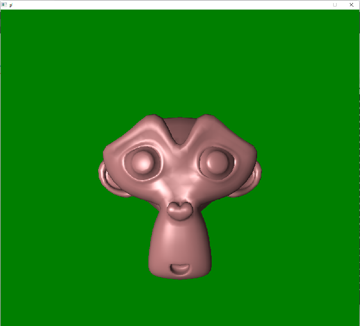

# tls1

A CPU rasterizer written in C++.

# features

* triangle rasterization
* .obj model loading
* point lights
* material types
  * lambertian BRDF
  * phong BRDF
  * Cook-Torrance BRDF
* texture mapping

# sample render

# motivation

This is a learning project. I wanted to study rendering fundamentals and to get some experience optimizing.

# limitations

* Performance
  * The project is single threaded. Many areas in the rendering pipeline can be parallelized to take advantage of multicore CPUs.
  * I was surprised to find that profiling indicated the longest part of rendering is accessing the material maps. I believe the naive linear layout I'm using is very cache unfriendly. I would expect a great performance improvement from switching to a tiled layout.
